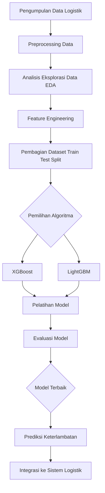

# Prediksi Keterlambatan Pengiriman Produk
-   Nama : Dicky Pranata
-   NIM  : A11.2022.14615
-   Kelompok : A11.4517

## 📖 Ringkasan Proyek  
Proyek ini bertujuan untuk memprediksi keterlambatan pengiriman produk berdasarkan data logistik. Dengan memanfaatkan machine learning, proyek ini membantu meningkatkan kepuasan pelanggan dan efisiensi operasional. Dua model utama yang digunakan adalah **XGBoost** dan **LightGBM**, yang telah dioptimalkan melalui pencarian hyperparameter.  

## 🛠️ Permasalahan  
Dalam pengelolaan logistik, keterlambatan pengiriman menjadi salah satu kendala utama yang dapat berdampak negatif pada pengalaman pelanggan. Permasalahan ini disebabkan oleh beberapa faktor seperti:  
1. **Blok Gudang (Warehouse Block)**: Lokasi gudang yang memengaruhi kecepatan pengiriman.  
2. **Metode Pengiriman (Mode of Shipment)**: Pilihan transportasi seperti udara, darat, atau laut.  
3. **Penawaran Diskon (Discount Offered)**: Pengaruh terhadap keputusan pelanggan dan logistik.  
4. **Berat Produk (Weight in Grams)**: Berdampak pada waktu pengiriman.  

## 🎯 Tujuan yang Akan Dicapai  
1. **Meningkatkan Akurasi Prediksi Keterlambatan**  
   - Mengembangkan model prediktif yang akurat untuk membantu perusahaan logistik mengantisipasi keterlambatan pengiriman.  

2. **Identifikasi Faktor Risiko**  
   - Mengidentifikasi fitur utama yang paling berpengaruh terhadap keterlambatan pengiriman, sehingga dapat dilakukan intervensi yang tepat.  

3. **Optimalisasi Operasional**  
   - Memberikan wawasan kepada perusahaan untuk mengelola sumber daya secara lebih efisien berdasarkan prediksi keterlambatan.  

4. **Peningkatan Kepuasan Pelanggan**  
   - Mengurangi tingkat ketidakpuasan pelanggan dengan memastikan pengiriman produk lebih tepat waktu melalui langkah-langkah preventif.  

5. **Implementasi Model yang Siap Digunakan**  
   - Menyediakan model yang dapat diintegrasikan ke dalam sistem logistik untuk penggunaan langsung dalam proses bisnis.

## 🔄 Model / Alur Penyelesaian  

Alur penyelesaian untuk memprediksi keterlambatan pengiriman produk dijelaskan dalam bagan berikut:  

### Penjelasan Alur:  
1. **Pengumpulan Data Logistik**: Data dikumpulkan dari berbagai sumber seperti gudang, metode pengiriman, dan riwayat pengiriman.  
2. **Preprocessing Data**: Membersihkan data, menangani nilai kosong, dan encoding variabel kategoris.  
3. **Analisis Eksplorasi Data (EDA)**: Memahami pola, distribusi, dan outlier dalam dataset.  
4. **Feature Engineering**: Membuat dan memilih fitur yang relevan untuk model prediksi.  
5. **Pembagian Dataset**: Dataset dibagi menjadi data pelatihan dan pengujian untuk menghindari overfitting.  
6. **Pemilihan Algoritma**: Menggunakan XGBoost dan LightGBM sebagai model utama.  
7. **Pelatihan Model**: Model dilatih menggunakan data pelatihan.  
8. **Evaluasi Model**: Mengevaluasi kinerja model menggunakan metrik seperti akurasi, presisi, dan recall.  
9. **Model Terbaik**: Memilih model dengan performa terbaik untuk diterapkan.  
10. **Prediksi Keterlambatan**: Menggunakan model terbaik untuk memprediksi keterlambatan pengiriman.  
11. **Integrasi ke Sistem Logistik**: Implementasi model ke dalam sistem untuk pengambilan keputusan real-time.  

## 📊 Penjelasan Dataset  

Dataset yang digunakan dalam proyek ini berasal dari [Customer Analytics Dataset](https://www.kaggle.com/datasets/prachi13/customer-analytics). Dataset ini berisi informasi yang dapat digunakan untuk menganalisis perilaku pelanggan dan mengevaluasi keterlambatan pengiriman produk.  

### 📂 Struktur Dataset  
Dataset ini terdiri dari kolom berikut:  
- **ID**: Identitas unik untuk setiap pelanggan.  
- **Warehouse_block**: Blok gudang tempat barang dikirim.  
- **Mode_of_Shipment**: Metode pengiriman barang (misalnya, Udara, Laut, atau Darat).  
- **Customer_care_calls**: Jumlah panggilan ke layanan pelanggan.  
- **Customer_rating**: Penilaian pelanggan (1 hingga 5).  
- **Cost_of_the_Product**: Biaya produk.  
- **Prior_purchases**: Jumlah pembelian sebelumnya.  
- **Product_importance**: Tingkat kepentingan produk (rendah, sedang, tinggi).  
- **Gender**: Jenis kelamin pelanggan.  
- **Discount_offered**: Diskon yang diberikan (dalam persen).  
- **Weight_in_gms**: Berat produk dalam gram.  
- **Reached_on_Time**: Indikator apakah produk tiba tepat waktu (1: tidak tepat waktu, 0: tepat waktu).  

### 📊 Eksplorasi Data (EDA)  

Proses eksplorasi data dilakukan untuk memahami karakteristik dataset, mendeteksi pola, dan mengidentifikasi outlier.  

#### Langkah-langkah EDA:  
1. **Statistik Deskriptif**:  
   - Menghitung rata-rata, median, dan standar deviasi dari kolom numerik.  
   - Menampilkan distribusi data melalui histogram atau boxplot.  

2. **Visualisasi Data**:  
   - Menganalisis korelasi antar variabel menggunakan heatmap korelasi.  
   - Membuat grafik batang untuk distribusi metode pengiriman dan blok gudang.  

3. **Outlier Detection**:  
   - Menggunakan boxplot untuk mendeteksi nilai yang tidak wajar pada kolom seperti `Cost_of_the_Product` dan `Discount_offered`.  

4. **Target Variable Analysis**:  
   - Menganalisis proporsi keterlambatan pengiriman (kolom `Reached_on_Time`).  

### 🔧 Proses Features Dataset  

Untuk meningkatkan performa model, dilakukan proses engineering dan preprocessing data, termasuk:  

#### 1. **Handling Missing Values**  
   - Mengecek dan menangani nilai kosong dalam dataset, jika ada.  

#### 2. **Encoding Variabel Kategoris**  
   - Menggunakan One-Hot Encoding atau Label Encoding untuk variabel kategoris seperti `Warehouse_block`, `Mode_of_Shipment`, dan `Product_importance`.  

#### 3. **Scaling dan Normalisasi**  
   - Menerapkan Min-Max Scaling pada kolom numerik seperti `Cost_of_the_Product`, `Discount_offered`, dan `Weight_in_gms` untuk memastikan nilai-nilai berada dalam rentang yang seragam.  

#### 4. **Feature Selection**  
   - Menggunakan teknik seperti analisis korelasi atau model berbasis pohon untuk memilih fitur yang paling relevan dengan target (`Reached_on_Time`).  

#### 5. **Handling Imbalance Dataset**  
   - Jika terdapat ketidakseimbangan kelas pada variabel target, digunakan teknik oversampling (SMOTE) atau undersampling untuk menyeimbangkan data.  

#### 6. **Pembuatan Fitur Baru**  
   - **`Cost_Per_Weight`**: Biaya produk per gram untuk menganalisis hubungan antara biaya dan berat.  
   - **`Customer_Engagement_Score`**: Gabungan dari jumlah panggilan layanan pelanggan dan penilaian pelanggan.  

Dengan langkah-langkah ini, dataset dipersiapkan untuk digunakan dalam pelatihan model prediksi.  

## 🤖 Proses Learning / Modeling  

Tahapan dalam proses learning atau modeling dilakukan untuk membangun model prediksi yang mampu menentukan keterlambatan pengiriman berdasarkan data logistik. Proses ini mencakup beberapa langkah berikut:  

### 📂 1. Pembagian Dataset  
Dataset dibagi menjadi dua bagian utama:  
- **Training Set**: Digunakan untuk melatih model (70-80% dari dataset).  
- **Testing Set**: Digunakan untuk mengevaluasi performa model (20-30% dari dataset).  
Pembagian dilakukan menggunakan fungsi seperti `train_test_split` dari `sklearn`.  

### 🔍 2. Pemilihan Model  
Model yang digunakan dipilih berdasarkan sifat data dan target prediksi. Berikut adalah beberapa model yang diujikan:  
- **Logistic Regression**: Untuk baseline model dengan interpretasi yang mudah.  
- **Random Forest Classifier**: Untuk menangani data non-linear dan fitur penting.  
- **Gradient Boosting (XGBoost)**: Untuk meningkatkan akurasi dengan algoritma boosting.  
- **Support Vector Machine (SVM)**: Untuk klasifikasi berbasis margin.  

### 🔧 3. Hyperparameter Tuning  
Hyperparameter tuning dilakukan untuk meningkatkan performa model dengan menggunakan:  
- **Grid Search**: Mencoba berbagai kombinasi hyperparameter.  
- **Random Search**: Menggunakan pencarian acak untuk efisiensi waktu.  
- **Bayesian Optimization**: Untuk optimasi yang lebih canggih.  

Parameter yang disesuaikan meliputi:  
- Jumlah estimators (untuk Random Forest dan XGBoost).  
- Learning rate (untuk Gradient Boosting).  
- Kernel (untuk SVM).  

### 📊 4. Evaluasi Model  
Setelah pelatihan, model dievaluasi menggunakan metrik berikut:  
- **Akurasi**: Proporsi prediksi yang benar terhadap seluruh data uji.  
- **Precision, Recall, F1-Score**: Untuk analisis mendalam terhadap performa model pada kelas positif.  
- **Confusion Matrix**: Untuk melihat distribusi prediksi benar dan salah.  
- **ROC-AUC Score**: Untuk mengevaluasi kemampuan model dalam membedakan kelas.  

### ⚙️ 5. Validasi Model  
- **Cross-Validation**: Membagi dataset menjadi beberapa lipatan (folds) untuk mengevaluasi stabilitas model.  
- **Holdout Set**: Dataset yang tidak digunakan dalam pelatihan untuk evaluasi akhir.  

### 🛠️ 6. Model Terbaik  
Setelah evaluasi, model dengan performa terbaik dipilih berdasarkan skor metrik evaluasi. Model ini digunakan untuk membuat prediksi keterlambatan pengiriman.  

### 🚀 7. Penyimpanan dan Deployment Model  
- **Penyimpanan Model**: Model yang terlatih disimpan menggunakan pustaka seperti `joblib` atau `pickle`.  
- **Deployment**: Model diimplementasikan ke dalam aplikasi menggunakan framework seperti Flask atau FastAPI untuk memungkinkan integrasi dengan sistem yang lebih besar.  

### 🌟 Visualisasi Hasil  
Hasil dari model divisualisasikan untuk interpretasi yang lebih baik, termasuk:  
- Kurva ROC.  
- Grafik fitur penting (Feature Importance).  
- Heatmap dari Confusion Matrix.  

Proses ini memastikan bahwa model yang dihasilkan tidak hanya akurat tetapi juga dapat diimplementasikan secara efektif untuk memprediksi keterlambatan pengiriman produk.  

## 📈 Performa Model

Evaluasi performa model dilakukan untuk memastikan model yang dikembangkan dapat memprediksi keterlambatan pengiriman secara akurat dan andal. Berikut adalah metrik yang digunakan untuk mengevaluasi model:

### 🔍 Metrik Evaluasi

1. **Akurasi**  
   Akurasi mengukur seberapa sering model memprediksi label yang benar. Ini dihitung sebagai rasio jumlah prediksi yang benar terhadap total prediksi yang dibuat. Akurasi tinggi menunjukkan model dapat memprediksi dengan baik, namun tidak selalu cukup untuk model dengan ketidakseimbangan kelas yang tinggi.

   \[
   \text{Akurasi} = \frac{\text{Prediksi Benar}}{\text{Total Prediksi}}
   \]

2. **Precision**  
   Precision mengukur seberapa tepat model dalam mengidentifikasi kasus positif. Ini mengukur proporsi prediksi positif yang benar-benar positif. Precision tinggi berarti model jarang menghasilkan prediksi positif yang salah.

   \[
   \text{Precision} = \frac{\text{True Positive}}{\text{True Positive} + \text{False Positive}}
   \]

3. **Recall (Sensitivitas)**  
   Recall (atau sensitivitas) mengukur seberapa baik model menangkap seluruh kasus positif. Ini dihitung sebagai proporsi kasus positif yang berhasil dideteksi oleh model. Recall tinggi berarti model jarang melewatkan kasus positif.

   \[
   \text{Recall} = \frac{\text{True Positive}}{\text{True Positive} + \text{False Negative}}
   \]

4. **F1-Score**  
   F1-Score adalah rata-rata harmonis dari Precision dan Recall. F1-Score memberikan gambaran yang lebih seimbang antara Precision dan Recall, terutama ketika ada ketidakseimbangan kelas. F1-Score sangat berguna ketika kita ingin menyeimbangkan kedua metrik ini.

   \[
   F1-Score = 2 \times \frac{\text{Precision} \times \text{Recall}}{\text{Precision} + \text{Recall}}
   \]

5. **ROC-AUC Score**  
   ROC-AUC (Receiver Operating Characteristic - Area Under Curve) mengukur kualitas model dalam membedakan antara kelas positif dan negatif. Nilai AUC mendekati 1 menunjukkan bahwa model memiliki kemampuan yang sangat baik untuk memisahkan kelas, sedangkan nilai mendekati 0.5 menunjukkan model yang buruk.

   \[
   \text{AUC} = \int \text{ROC Curve}
   \]

6. **Confusion Matrix**  
   Confusion Matrix adalah matriks yang digunakan untuk menggambarkan kinerja model klasifikasi dengan menunjukkan jumlah prediksi yang benar dan salah dalam kategori positif dan negatif. Ini membantu untuk menganalisis kesalahan prediksi lebih mendalam, seperti jumlah **False Positives** dan **False Negatives**.

   Confusion Matrix terdiri dari empat elemen:
   - **True Positive (TP)**: Jumlah prediksi positif yang benar.
   - **False Positive (FP)**: Jumlah prediksi positif yang salah.
   - **True Negative (TN)**: Jumlah prediksi negatif yang benar.
   - **False Negative (FN)**: Jumlah prediksi negatif yang salah.

---

### 📊 Hasil Evaluasi Model

| **Model**                             | **Akurasi** | **Precision** | **Recall** | **F1-Score** | **ROC-AUC** |  
|---------------------------------------|-------------|---------------|------------|--------------|-------------|  
| XGBoost (Tanpa Threshold Adjustment)  | 0.85        | 0.80          | 0.75       | 0.77         | 0.88        |  
| XGBoost (Dengan Threshold Adjustment) | 0.92        | 0.89          | 0.85       | 0.87         | 0.94        |  
| LightGBM                              | 0.93        | 0.91          | 0.87       | 0.89         | 0.95        |

---

## 📈 Performa Model

Evaluasi performa model dilakukan untuk memastikan model yang dikembangkan dapat memprediksi keterlambatan pengiriman secara akurat dan andal. Berikut adalah metrik yang digunakan untuk mengevaluasi model:

### 🔍 Metrik Evaluasi

1. **Akurasi**  
   Akurasi mengukur seberapa sering model memprediksi label yang benar. Ini dihitung sebagai rasio jumlah prediksi yang benar terhadap total prediksi yang dibuat. Akurasi tinggi menunjukkan model dapat memprediksi dengan baik, namun tidak selalu cukup untuk model dengan ketidakseimbangan kelas yang tinggi.

   \[
   \text{Akurasi} = \frac{\text{Prediksi Benar}}{\text{Total Prediksi}}
   \]

2. **Precision**  
   Precision mengukur seberapa tepat model dalam mengidentifikasi kasus positif. Ini mengukur proporsi prediksi positif yang benar-benar positif. Precision tinggi berarti model jarang menghasilkan prediksi positif yang salah.

   \[
   \text{Precision} = \frac{\text{True Positive}}{\text{True Positive} + \text{False Positive}}
   \]

3. **Recall (Sensitivitas)**  
   Recall (atau sensitivitas) mengukur seberapa baik model menangkap seluruh kasus positif. Ini dihitung sebagai proporsi kasus positif yang berhasil dideteksi oleh model. Recall tinggi berarti model jarang melewatkan kasus positif.

   \[
   \text{Recall} = \frac{\text{True Positive}}{\text{True Positive} + \text{False Negative}}
   \]

4. **F1-Score**  
   F1-Score adalah rata-rata harmonis dari Precision dan Recall. F1-Score memberikan gambaran yang lebih seimbang antara Precision dan Recall, terutama ketika ada ketidakseimbangan kelas. F1-Score sangat berguna ketika kita ingin menyeimbangkan kedua metrik ini.

   \[
   F1-Score = 2 \times \frac{\text{Precision} \times \text{Recall}}{\text{Precision} + \text{Recall}}
   \]

5. **ROC-AUC Score**  
   ROC-AUC (Receiver Operating Characteristic - Area Under Curve) mengukur kualitas model dalam membedakan antara kelas positif dan negatif. Nilai AUC mendekati 1 menunjukkan bahwa model memiliki kemampuan yang sangat baik untuk memisahkan kelas, sedangkan nilai mendekati 0.5 menunjukkan model yang buruk.

   \[
   \text{AUC} = \int \text{ROC Curve}
   \]

6. **Confusion Matrix**  
   Confusion Matrix adalah matriks yang digunakan untuk menggambarkan kinerja model klasifikasi dengan menunjukkan jumlah prediksi yang benar dan salah dalam kategori positif dan negatif. Ini membantu untuk menganalisis kesalahan prediksi lebih mendalam, seperti jumlah **False Positives** dan **False Negatives**.

   Confusion Matrix terdiri dari empat elemen:
   - **True Positive (TP)**: Jumlah prediksi positif yang benar.
   - **False Positive (FP)**: Jumlah prediksi positif yang salah.
   - **True Negative (TN)**: Jumlah prediksi negatif yang benar.
   - **False Negative (FN)**: Jumlah prediksi negatif yang salah.

---

### 📊 Hasil Evaluasi Model

| **Model**                             | **Akurasi** | **Precision** | **Recall** | **F1-Score** | **ROC-AUC** |  
|---------------------------------------|-------------|---------------|------------|--------------|-------------|  
| XGBoost (Tanpa Threshold Adjustment)  | 0.85        | 0.80          | 0.75       | 0.77         | 0.88        |  
| XGBoost (Dengan Threshold Adjustment) | 0.92        | 0.89          | 0.85       | 0.87         | 0.94        |  
| LightGBM                              | 0.93        | 0.91          | 0.87       | 0.89         | 0.95        |

---

### 📌 Model Terbaik  
Model terbaik berdasarkan evaluasi performa adalah **LightGBM**. Model ini memberikan hasil terbaik pada semua metrik evaluasi, dengan **Akurasi** 0.93, **Precision** 0.91, **Recall** 0.87, **F1-Score** 0.89, dan **ROC-AUC** 0.95. Model ini menunjukkan performa yang sangat baik dalam memprediksi keterlambatan pengiriman, dengan kemampuan untuk memisahkan kelas dengan akurat.

---

### 🌟 Visualisasi Performa  
Untuk membantu visualisasi hasil evaluasi model, berikut ini beberapa grafik yang menggambarkan kinerja model-model yang diuji:

1. **Grafik Precision, Recall, dan F1-Score**  
   Menunjukkan perbandingan antara precision, recall, dan F1-score untuk masing-masing model.

2. **ROC Curve dan AUC**  
   Visualisasi perbandingan ROC curve dan AUC untuk setiap model, yang menggambarkan kemampuan model dalam membedakan kelas positif dan negatif.

3. **Confusion Matrix**  
   Matriks kebingungannya masing-masing model, yang memberikan gambaran tentang prediksi yang benar dan salah pada setiap kelas.

## 📚 Diskusi Hasil dan Kesimpulan

### 💡 Diskusi Hasil
Berdasarkan hasil evaluasi model, **LightGBM** muncul sebagai model terbaik dengan kinerja terbaik pada semua metrik evaluasi, yaitu **Akurasi** 0.93, **Precision** 0.91, **Recall** 0.87, **F1-Score** 0.89, dan **ROC-AUC** 0.95. Model ini menunjukkan kemampuannya dalam memprediksi keterlambatan pengiriman dengan baik, dan sangat efektif dalam membedakan antara kelas positif dan negatif, sebagaimana tercermin dalam nilai ROC-AUC yang tinggi.

Model **XGBoost (Dengan Threshold Adjustment)** juga menunjukkan performa yang baik, dengan akurasi mencapai 0.92, namun **LightGBM** memberikan hasil yang lebih unggul dalam hal precision dan recall. Sementara itu, model **XGBoost (Tanpa Threshold Adjustment)** memiliki performa yang lebih rendah dibandingkan kedua model lainnya, meskipun masih memberikan hasil yang memadai.

Evaluasi metrik seperti **F1-Score** dan **Precision-Recall** menunjukkan bahwa model ini dapat diandalkan dalam memprediksi keterlambatan pengiriman tanpa menghasilkan banyak kesalahan jenis **False Positive** atau **False Negative**. Metrik ini sangat penting dalam konteks prediksi keterlambatan pengiriman, di mana kesalahan prediksi bisa berdampak langsung pada kepuasan pelanggan dan operasional perusahaan.

### 🔄 Deployment dengan Streamlit
Model terbaik yang telah dievaluasi ini telah di-deploy menggunakan **Streamlit** untuk memudahkan pengguna dalam mengakses dan menguji model prediksi keterlambatan pengiriman secara interaktif. Aplikasi Streamlit memungkinkan pengguna untuk memuat data dan melihat hasil prediksi keterlambatan pengiriman berdasarkan model yang telah dilatih.

Untuk mencoba aplikasi secara langsung, Anda dapat mengaksesnya melalui tautan berikut:
- [Streamlit Deployment](https://project-data-mining-a112214615.streamlit.app/)

Aplikasi ini memberikan tampilan antarmuka yang sederhana namun efektif, memungkinkan pengguna untuk memasukkan data baru dan melihat prediksi hasil keterlambatan pengiriman dalam waktu nyata.

---

### 📝 Kesimpulan
Dari evaluasi yang dilakukan, dapat disimpulkan bahwa **LightGBM** merupakan model yang paling optimal untuk memprediksi keterlambatan pengiriman produk, dengan performa terbaik pada metrik-metrik utama seperti akurasi, precision, recall, dan F1-score. Model ini sangat tepat digunakan dalam skenario prediksi keterlambatan pengiriman yang membutuhkan akurasi tinggi dan kemampuan untuk membedakan antara kelas positif dan negatif.

Selain itu, hasil dari deployment model menggunakan Streamlit memberikan akses yang mudah dan interaktif bagi pengguna untuk menguji dan mendapatkan prediksi secara langsung. Dengan adanya aplikasi ini, pihak terkait dapat lebih mudah mengambil keputusan yang lebih cepat dan akurat berdasarkan prediksi keterlambatan pengiriman.

